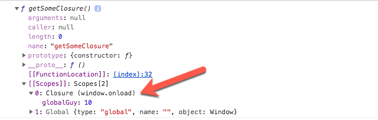

Well, there are already countless guides, explanations and videos on Javascript and closures. Sadly, most of them are too complex to assimilate. Here is a simple explanation of Closures that you will not forget. And NO! it doesn't start like "when a function returns a function ..."

> A closure is the combination of a function and the lexical environment within which that function was declared.

As fancy as it sounds, it just means that a closure is function holding on to the environment(variables etc) in which it was declared. How, you might ask. And to understand that, let's look at the code below:

```javascript
var globalGuy = 10;
var getSomeClosure = function () {
    var insideGuy = 5;
    return insideGuy + globalGuy;
}
console.dir(getSomeClosure)
```

So where is closure in this? It just looks like a stupid code block. Here is the output on console however:



Notice that this function is maintaining an object with the value of globalGuy. And this is all closure is. All you need to understand is:

> When a function uses a variable from any scope higher than it's own, it will create an object to store these variables. This object is called closure.


